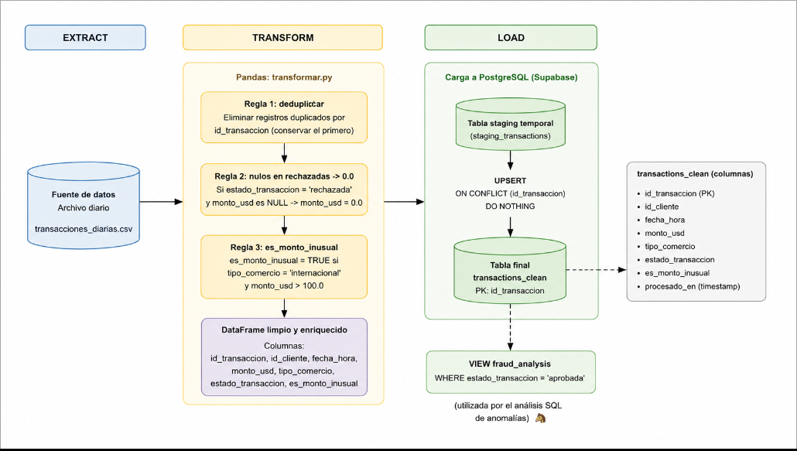
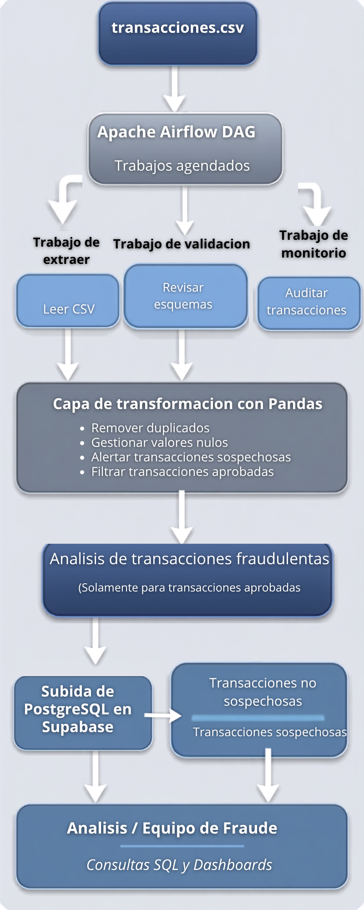
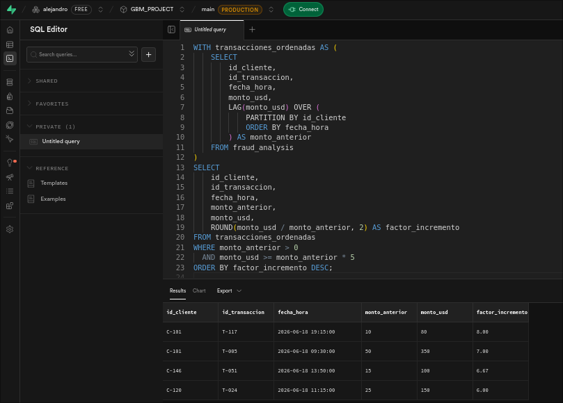

# Prueba Técnica: Associate Data Engineer

Pipeline de limpieza, carga y detección de anomalías de gasto para transacciones
de tarjetas de crédito del área de prevención de fraude del banco.

## Fase 1: Diseño del Flujo y Toma de Decisiones

### 1. Justificación de Calidad de Datos

En un entorno bancario, la calidad de los datos es un requisito fundamental para
garantizar la confiabilidad de los análisis de fraude y la correcta toma de
decisiones de negocio. Los modelos analíticos y las alertas operativas dependen
directamente de la consistencia de la información procesada.

La eliminación de registros duplicados evita que una misma transacción sea
contabilizada múltiples veces, lo que podría generar falsos positivos en los
análisis de comportamiento financiero y distorsionar métricas operativas.

La corrección de valores faltantes en transacciones rechazadas permite mantener
la integridad semántica de los datos. Dado que una transacción rechazada no
representa un movimiento financiero efectivo, asignar un monto de 0.0
estandariza el tratamiento de estos registros y evita inconsistencias
posteriores.

La clasificación de montos inusuales facilita la identificación temprana de
patrones de riesgo. Las transacciones internacionales de alto valor representan
un escenario común de monitoreo dentro de los sistemas de prevención de fraude y
cumplimiento normativo.

Finalmente, el aislamiento exclusivo de transacciones aprobadas para el análisis
de anomalías garantiza que los modelos trabajen únicamente sobre movimientos
financieros reales. Incluir operaciones rechazadas o pendientes podría
introducir ruido analítico y afectar la precisión de los resultados.


### 2. Decisiones de Arquitectura

La solución propuesta implementa una arquitectura ETL ligera orientada a
procesamiento batch diario.

Aunque el archivo de entrada es pequeño, la arquitectura considera un escenario
real donde diariamente podrían procesarse cientos de miles o millones de
transacciones.
Por esta razón, la arquitectura incorpora componentes ampliamente utilizados en
entornos empresariales:

- **Apache Airflow** para la orquestación y programación de pipelines.
- **Pandas** para la transformación y limpieza de datos.
- **PostgreSQL (Supabase)** como repositorio persistente de datos procesados.
- **SQL** para consultas analíticas y generación de reportes.

Apache Airflow permite definir DAGs que automatizan la ejecución diaria del
proceso, proporcionando monitoreo, reintentos automáticos, trazabilidad y
escalabilidad operativa. Estas características son especialmente relevantes en
sistemas financieros donde la disponibilidad y confiabilidad del procesamiento
son críticas.

Pandas ofrece una implementación eficiente para el volumen esperado de la
prueba técnica y simplifica la aplicación de reglas de calidad de datos
mediante operaciones vectorizadas.

PostgreSQL fue seleccionado por ser un motor relacional maduro, ampliamente
utilizado en entornos empresariales, con soporte para transacciones ACID,
índices, particionamiento y capacidades analíticas avanzadas. La utilización de
Supabase permite disponer de una instancia PostgreSQL administrada reduciendo
la complejidad operativa del despliegue.


#### Tecnologías utilizadas

- Apache Airflow
- Python 3.x
- Pandas
- SQLAlchemy
- PostgreSQL (Supabase)

#### Justificación de las librerías

**Pandas** — Aplicación de reglas de calidad, transformación y enriquecimiento
de datos mediante operaciones vectorizadas sobre DataFrames.

**SQLAlchemy** — Manejo de conexiones y persistencia hacia PostgreSQL.

**Apache Airflow** — Orquestación, monitoreo, programación y observabilidad del
pipeline de datos.

**PostgreSQL (Supabase)** — Persistencia transaccional y soporte para consultas
analíticas posteriores.

**os (biblioteca estándar)** — Acceso a variables de entorno sin exponer
credenciales en el código fuente (usuario, contraseña, host y cadena de
conexión hacia Supabase se leen desde `SUPABASE_DB_URL`).

#### Diagrama de flujo



### 3. Estructura de Datos

#### CSV de entrada (`data/transacciones_diarias.csv`)

| Columna              | Tipo     | Notas                                          |
| -------------------- | -------- | ---------------------------------------------- |
| `id_transaccion`     | STRING   | Clave de deduplicación (Regla 1)               |
| `id_cliente`         | STRING   | Identificador del cliente                      |
| `fecha_hora`         | DATETIME | Timestamp de la operación                      |
| `monto_usd`          | FLOAT    | Nullable — nulo válido en rechazadas (Regla 2) |
| `tipo_comercio`      | STRING   | `nacional` / `internacional` (Regla 3)         |
| `estado_transaccion` | STRING   | `aprobada` / `rechazada` / `pendiente`         |

#### Base de datos (`PostgreSQL / Supabase`)

**`transactions_clean`** (tabla) — Almacena todas las transacciones que
superaron la limpieza. Incluye la columna derivada `es_monto_inusual`
(calculada en la capa Pandas) y `procesado_en` para trazabilidad del pipeline.
`id_transaccion` es `PRIMARY KEY` — segunda línea de defensa contra duplicados
después de la deduplicación en memoria.

**`fraud_analysis`** (VIEW) — No es una tabla independiente sino una vista SQL
sobre `transactions_clean` con filtro `WHERE estado_transaccion = 'aprobada'`.
Esto elimina la duplicación de storage, garantiza consistencia automática con
los datos limpios y mantiene un único punto de escritura en el pipeline. Si el
volumen crece y la vista se ve degradada en latencia, se puede migrar a una
vista materializada (`MATERIALIZED VIEW`).

## Fase 2: Construcción

### Estructura del repositorio

```
.
├── data/
│   └── transacciones_diarias.csv
├── src/
│   ├── transformar.py   # Reglas 1, 2 y 3 (pandas)
│   ├── cargar.py        # Conexión y carga a Supabase (SQLAlchemy)
│   └── main.py           # Orquesta transformar() + cargar()
├── sql/
│   └── analisis_anomalias.sql   # Regla 4, CTE + Window Function
├── tests/
│   └── test_transformar.py      # Self-check de las 3 reglas
├── dag_transacciones.py         # Orquestación conceptual (Fase 3)
├── requirements.txt
└── .env.example
```

### Instrucciones de ejecución

```bash
python3 -m venv venv && source venv/bin/activate
pip install -r requirements.txt

cp .env.example .env          # completar con las credenciales reales de Supabase
source .env

python3 -m src.main           # transforma data/transacciones_diarias.csv y carga a Supabase

python3 tests/test_transformar.py   # self-check de las reglas de negocio
```

Una vez cargados los datos, ejecutar `sql/analisis_anomalias.sql` desde el SQL
Editor de Supabase para obtener los clientes con saltos de gasto ≥ 5x.

### Evidencia de ejecución en Supabase



## Fase 3: Propuesta de Orquestación

`dag_transacciones.py` define el DAG conceptual:

- **Programación:** `30 23 * * *` → todos los días a las 11:30 PM.
- **Tarea 1 — `transformar_y_cargar`:** `PythonOperator` que invoca
  `src.main.main`, aplicando las reglas 1, 2 y 3 y cargando a
  `transactions_clean`.
- **Tarea 2 — `analizar_anomalias`:** `PostgresOperator` que ejecuta
  `sql/analisis_anomalias.sql` contra `fraud_analysis` (Regla 4 aplicada
  estructuralmente por la vista).
- **Dependencia:** `tarea_transformar_y_cargar >> tarea_analizar_anomalias`. El
  `trigger_rule` por defecto de Airflow (`all_success`) garantiza que el
  análisis SQL solo corra si la carga finalizó sin errores.

No se requiere levantar un servidor de Airflow para esta entrega; el archivo
es código conceptual que demuestra sintaxis, _scheduling_ y dependencias.
